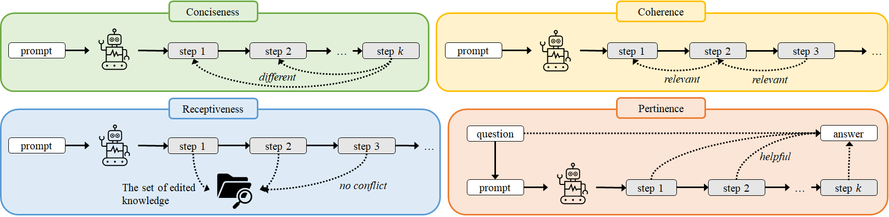

# MQuAKE

This is the repository for our paper [DeepEdit: Knowledge Editing as Decoding with Constraints](https://arxiv.org/abs/2401.10471).

We explore editing the knowledge of black-box LLMs in the decoding stage. We propose DeepEdit (Depth-first Search based Iterative Decoding for Knowledge Editing), a neural-symbolic method that improves the knowledge editing with better coherence, relevance, and awareness during reasoning. DeepEdit can be flexibly applied to all black-box LLMs: it does not require any access to the model parameters, representations, or output vocabulary distributions. 

DeepEdit progressively assesses every reasoning step in terms of effective knowledge editing. It utilizes a depth-first search to efficiently revise the LLMs' output, which improves the informativeness of output reasoning to the input question. 

Qualitatively, DeepEdit effectively monitors and controls LLMs to produce more succinct and effective reasoning in accord with knowledge editing. Quantitatively, DeepEdit yields significant gains on MQuaKE, a challenging multi-hop question-answering dataset, with knowledge editing.

Please see [our paper](https://arxiv.org/abs/2401.10471) for more details.

## DeepEdit

A python notebook for running DeepEdit on `gpt-3.5-turbo-instruct` is here: [`run_deepedit.ipynb`](https://github.com/wangywUST/DeepEdit/blob/main/run_deepedit.ipynb).

## Bugs or Questions?
If you have any questions related to the repo or the paper, or you encounter any problems when using the datasets/code, feel free to email Yiwei Wang `(wangyw.evan@gmail.com)` or open an issue!