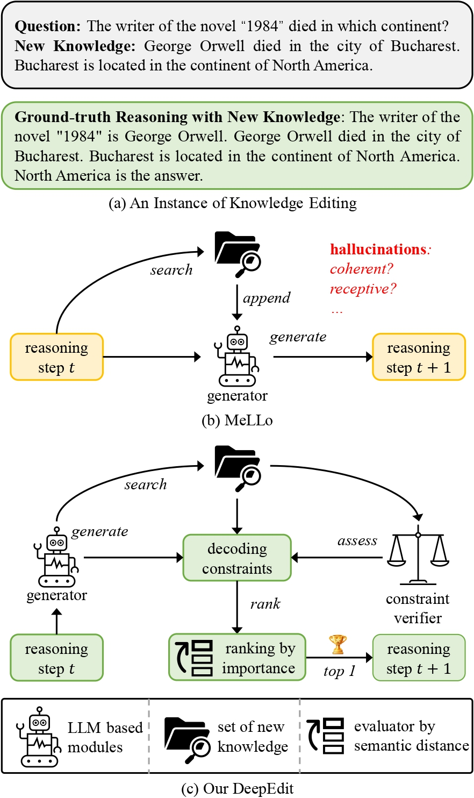

# DeepEdit

This is the repository for our paper [DeepEdit: Knowledge Editing as Decoding with Constraints](https://arxiv.org/abs/2401.10471).

## New Benchmarks of MQuAKE-2002 and MQuAKE-hard for Resolving the Annotation Mistakes 🆘 in [MQuAKE](https://github.com/princeton-nlp/MQuAKE).

### Annotation Mistakes in One-Third Instances of MQuAKE-3k.
  There are two issues of using MQuAKE-3k to evaluate KE (knowledge editing) methods. The first issue is that the new knowledge from different instances MQuAKE-3k can cause conflicts and mistakes to the ground-truth answers. In other words, the ground-truth answer from instance A can be altered by the new knowledge from another instance B. We show an example of knowledge conflicts in MQuAKE-3k in the below Figure. These knowledge conflicts will make the ground-truth answers incorrect given the new knowledge that are conflicted with the answers because the inference on every instance would retrieve the new knowledge from all instances. We observe that 998 instances' ground-truth answers are broken by the new knowledge from other instances❗

  
### New Benchmark MQuAKE-2002 for More Precise Evaluation.
  
 To address the issue of annotation mistakes in MQuAKE-3k, we provide a new subset of MQuAKE-3k, which does not have any knowledge conflict across instances. This subset includes 2,002 instances, so we term it as MQuAKE-2002. We filter out the instances of which the ground-truth answers are broken by the new knowledge from other instances to produce MQuAKE-2002. Compared with MQuAKE-3k, our MQuAKE-2002 provides a more precise evaluation for knowledge editing methods, since it removes the annotation mistakes due to knowledge conflicts across instances. The data statistics of MQuAKE-2002 are provided in the below Table.  

### New Benchmark MQuAKE-hard for More Challenging Evaluation.

 The second issue of MQuAKE-3k is that more than 66% instances in MQuAKE-3k only contain at most two edited facts that influence the answers, which are not challenging enough to evaluate the knowledge editing methods on handling multiple edited facts that can alter the ground-truth reasons. We construct a more challenging subset of MQuAKE by selecting the instances that contain the highest number of edited facts per instance. We term this challenging set as MQuAKE-hard, which includes 429 instances and every instance contains four edited facts. MQuAKE-hard has no overlap with MQuAKE-3k. We term this challenging set as MQuAKE-hard, which includes 429 instances and every instance contains four edited facts. MQuAKE-hard has no overlap with MQuAKE-3k. The data statistics of MQuAKE-hard are also provided in the below Table.

We provide the new benchmarks [MQuAKE-2002](https://github.com/wangywUST/DeepEdit/blob/main/datasets/MQuAKE-2002.json) and [MQuAKE-hard](https://github.com/wangywUST/DeepEdit/blob/main/datasets/MQuAKE-hard.json) at the folder `datasets`.

## DeepEdit

We explore editing the knowledge of black-box LLMs in the decoding stage. We propose DeepEdit (Depth-first Search based Iterative Decoding for Knowledge Editing), a neural-symbolic method that improves the knowledge editing with better coherence, relevance, and awareness during reasoning. DeepEdit can be flexibly applied to all black-box LLMs: it does not require any access to the model parameters, representations, or output vocabulary distributions. 

DeepEdit progressively assesses every reasoning step in terms of effective knowledge editing. It utilizes a depth-first search to efficiently revise the LLMs' output, which improves the informativeness of output reasoning to the input question. 

Qualitatively, DeepEdit effectively monitors and controls LLMs to produce more succinct and effective reasoning in accord with knowledge editing. Quantitatively, DeepEdit yields significant gains on MQuaKE, a challenging multi-hop question-answering dataset, with knowledge editing.

Please see [our paper](https://arxiv.org/abs/2401.10471) for more details.

A python notebook for running DeepEdit on `gpt-3.5-turbo-instruct` is here: [`run_deepedit.ipynb`](https://github.com/wangywUST/DeepEdit/blob/main/run_deepedit.ipynb).

## Bugs or Questions?
If you have any questions related to the repo or the paper, or you encounter any problems when using the datasets/code, feel free to email Yiwei Wang `(wangyw.evan@gmail.com)` or open an issue!